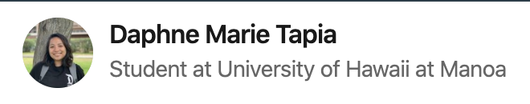

The course <i>ICS 314: Software Engineering I</i>

<h4>Open Source Software Development</h4>

 According to <a href="https://en.wikipedia.org/wiki/Open-source_software_development">Wikipedia</a> open-source software development is "the process by which open-source software, or similar software whose source code is publicly available, is developed by an open-source software project". And this, I believe that one of the goals of this class is for students to experience just this, which we really did. Before this class, my github only contained one project that I did for an earlier ICS class. Now that it has ended, it contains different repositories created from the experiences provided by this class, our final project (<a href="https://warrior-jam.github.io/">WarriorJam</a>), and a project my friends and I did for HACC (<a href="https://devpost.com/software/heco-stations">Thique-Atto</a>), and most of it can be accessed by the public for people to be able to experience them or to even learn from them.

<h4>Testing</h4>

Now, one of the most important steps in software development is testing. It helps a programmer realize what they habe to improve, what works best for their project, what the problems are, etc. Before taking this course and during the first few meetings in this class, I had this bad habit of only testing my codes at the end. I say this is a bad habit, because if there's a bug somewhere, it will be hard to find if one has already written tons of codes, even with the help of the console. Ever since I realized that, every time I make significant changes, such as building a page or creating a function, I make sure to test if they work first, before moving on to the next thing that I have to do. It saved me so much more time which was vital in this class.

I have definitely learned a lot of stuff in this class and I know I have so much more to improve on. If there are students out there who are interested in web development, functional programming, and also, competitions, then I suggest taking this class. It has helped me a lot to become a better programmer, experience new things, and of course, made me love programming even more.

