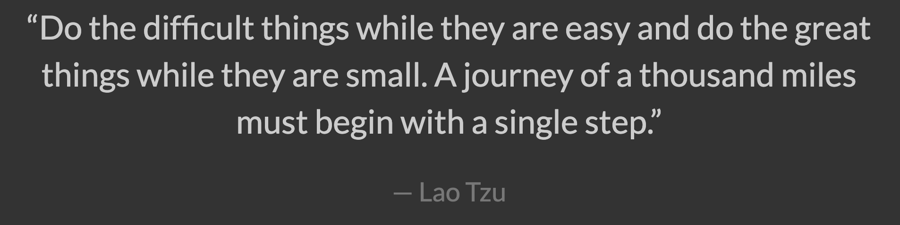

I was introduced to programming in 2011 through Visual Basic. Later on, I also used C, Python, Java, and then now, Javascript. So far, my favorite is Python, but I have also been enjoying Javascript.

I haven't done any programming for the past year and a half. However, due to my experience with the other programming languages, the modules on the FreeCodeCamp website were quite easy for me. The built-in functions and properties were similar to those from Java. However, yet again, some of the challenges on the ES6 module were quite challenging, but it has also taught me a few things, such as the arrow functions and the destructuring. I do not remember using those in my classes before. However, I could see how they can be useful techniques, especially when working with WODs later on.

So far, I have found the practice WODs pretty challenging. This is because I have a hard time remembering functions. However, I think if I do more of it, it would get easier. In fact, on my second tries, I only use half as much time as I used during my first ones. Even though they are challenging at first, I really enjoy them, because they make my brain work a lot. I really think practice helps as well. If I didn't go to the practice WOD organized by Rashmi, our teaching assistant, I don't think I would have gotten a 90 on my first WOD. 

Overall, I have enjoyed Javascript. Though the modules at the FreeCodeCamp were quite easy, I think it was necessary to start with it. Additonally, I do think that the WODs help a lot, because we are able to practice our programming skills during those times.

<a href="https://www.freecodecamp.org/">Image Source</a>
