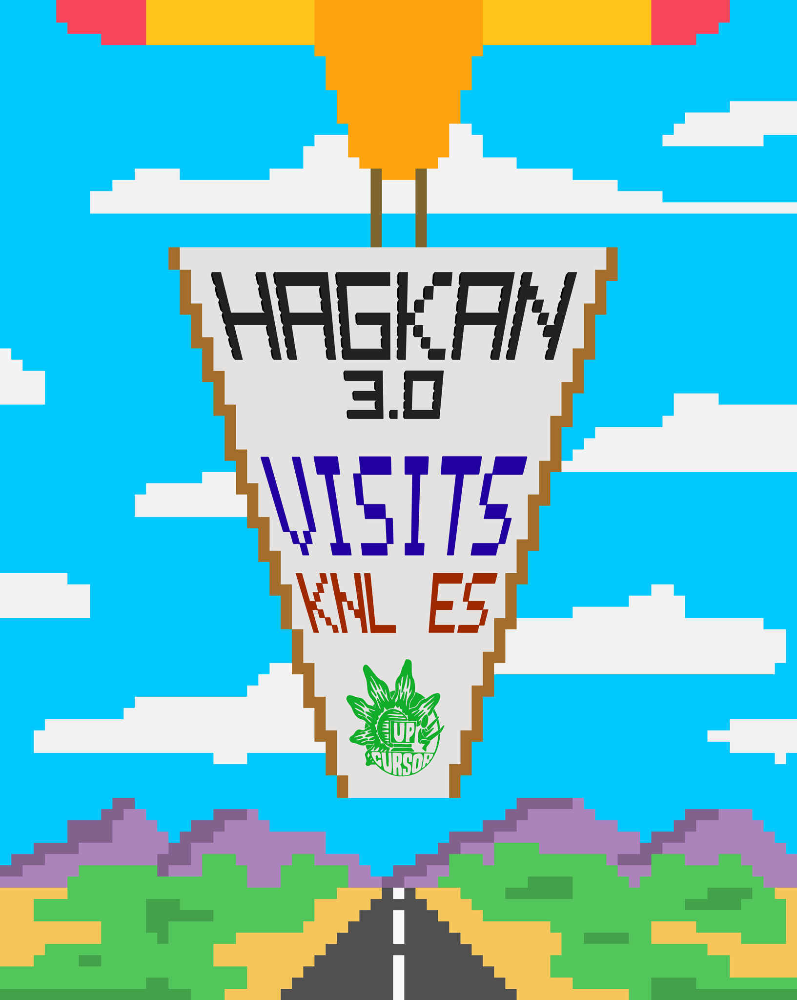

HagKan is a shortened term for Handog Kaalaman. These are two Filipino words that mean 'offering' and 'knowledge' respectively. This is an event formed by the UP Association of Computer Science Majors (UP CURSOR) of the University of the Philippines - Diliman. The organization aims to impart basic computer knowledge to people, usually public school students, who have limited resources.

"HagKan Kids 3.0 is a series of lectures for public elementary students, dedicated to teach them the basic uses of open-source programs such as OpenOffice and other tools on the internet." (<a href="https://www.facebook.com/HandogKaalaman/">Hagkan: Handog Kaalaman</a>)

