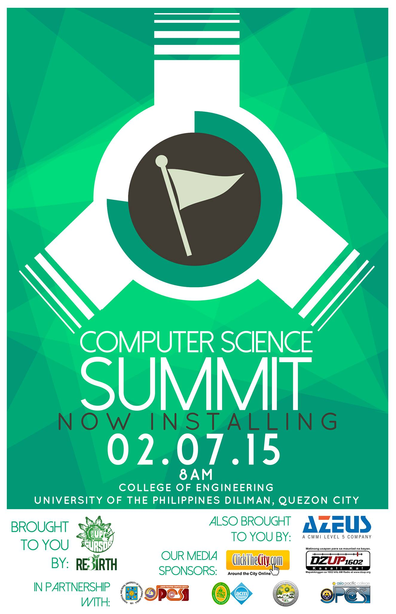

Computer Science Summit (CSS) 1.0: Now Installing... is the first installment of a seminar-workshop organized by the UP Association of Computer Science Majors (UP CURSOR) of the University of the Philippines - Diliman in 2015. I was a part of its steering commitee and mostly worked with the documentation of the event through taking photographs and collecting feedback from the atendees.

CSS aims to build the foundation for bridges between Computer Science/IT tertiary students that promote and show the applications and necessity of Computer Science in our lives through talks that entail discussions about CS in our lives, workshops that foster interaction and bonds between students of different levels, and exhibits that showcase the Computer Science Career Path as a whole. (Source: <a href="https://www.facebook.com/pg/thecssummit/">Computer Science Summit</a>)
