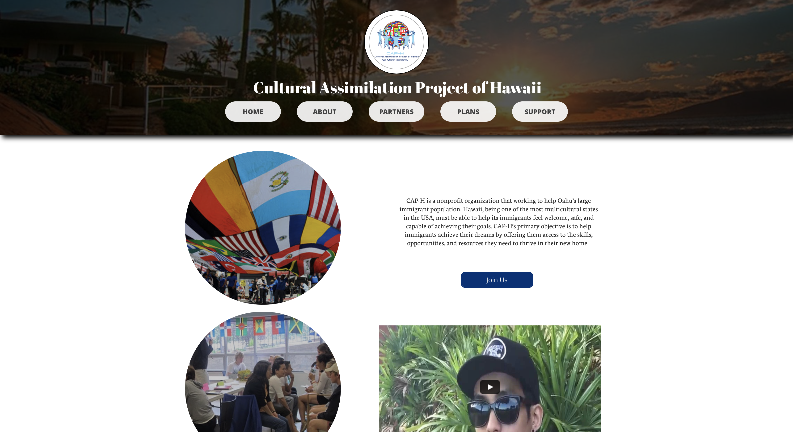

As a requirement for my ENG 100 class in Fall 2015 with Prof. Beau Ewan, we were required to create a hypothetical nonprofit organization that could improve life in Oahu. As students who come from different backgrounds or ethnicities, we decided to build an organization that will help unify the cultural differences of the people in Hawai'i and help immigrants build a life on the island of Oahu. We called it the Cultural Assimilation Project of Hawai'i (CAP-H).

We first researched about different existing NGOs that already exist for inspiration. Then, we had to make the organization seem real by putting it on social media and creating a website. My contribution was writing part of the research found on the history page of, editing the video used for and building the website. I also created the different social media accounts for CAP-H which have links that can be found on the bottom of the website.

Website: <a href="https://cap-h.my-free.website">Cultural Assimilation Project of Hawai'i</a>

YouTube Video: <a href="https://www.youtube.com/watch?v=DwcbESDhuPs">Introduction Video</a>
