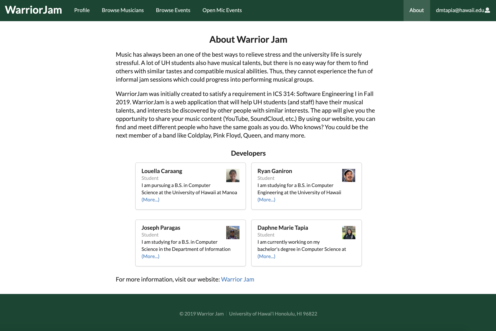
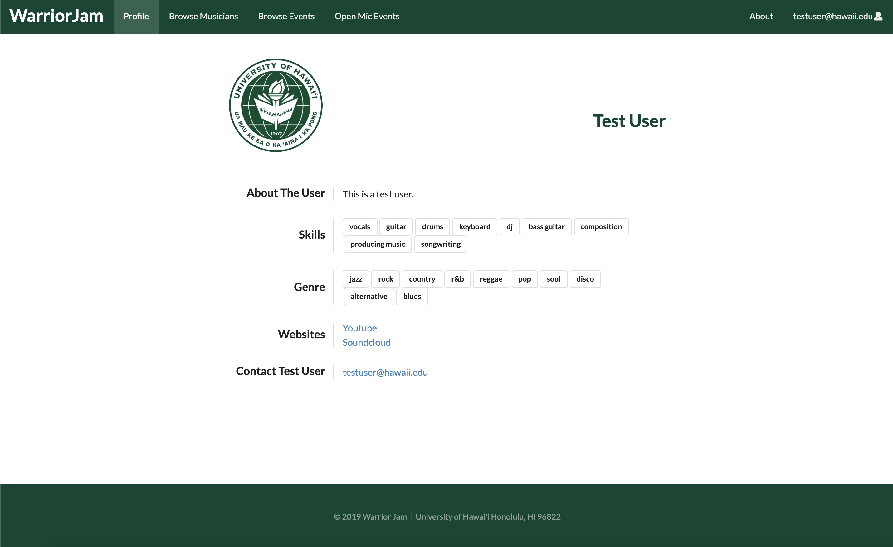
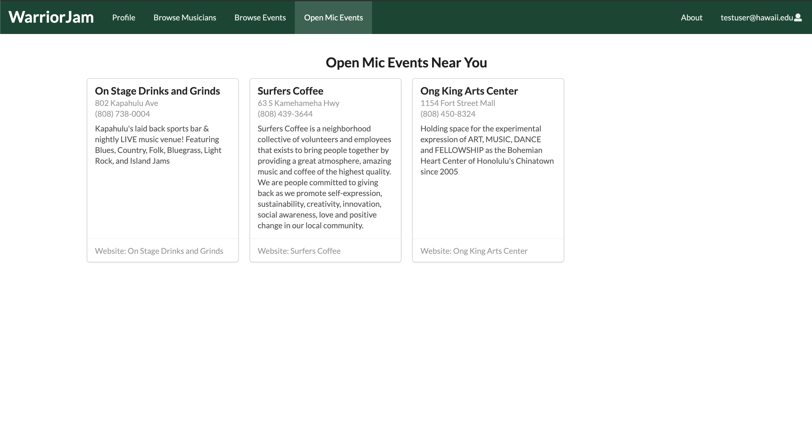
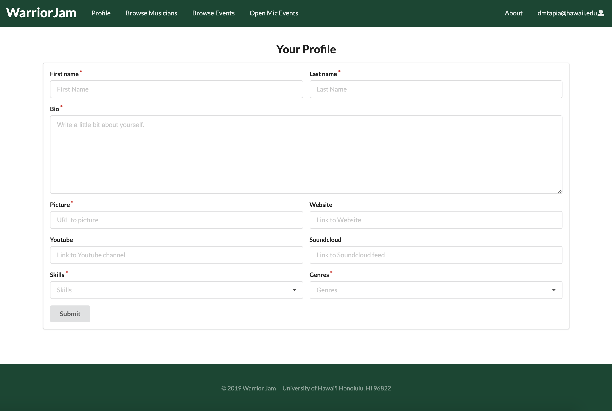
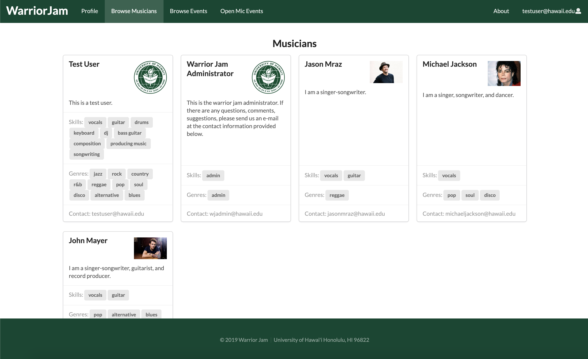
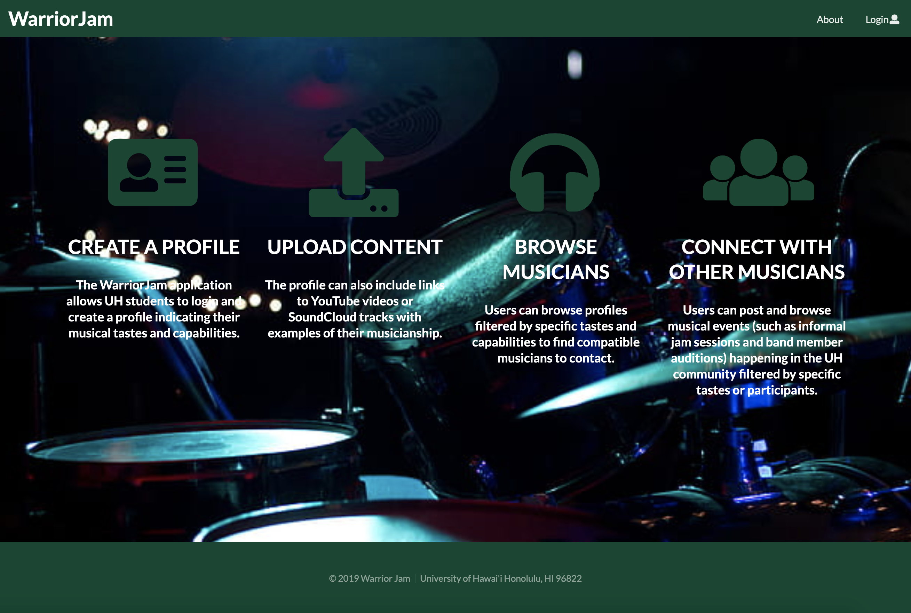

For my ICS 314: Software Engineering I class, I collaborated with three of my classmates, <a href="https://ryan38.github.io/">Ryan Ganiron</a>, <a href="https://joeparagas.github.io/">Joseph Paragas</a>, <a href="https://lcaraang.github.io/">Louella Caraang</a>, in order to build a web application called WarriorJam. The idea is to create an avenue for students, teachers, and/or staff who are musically inclined to collaborate with others who share the same interests.

Website: <a href="https://warrior-jam.github.io/">Cultural Assimilation Project of Hawai'i</a>

</div
